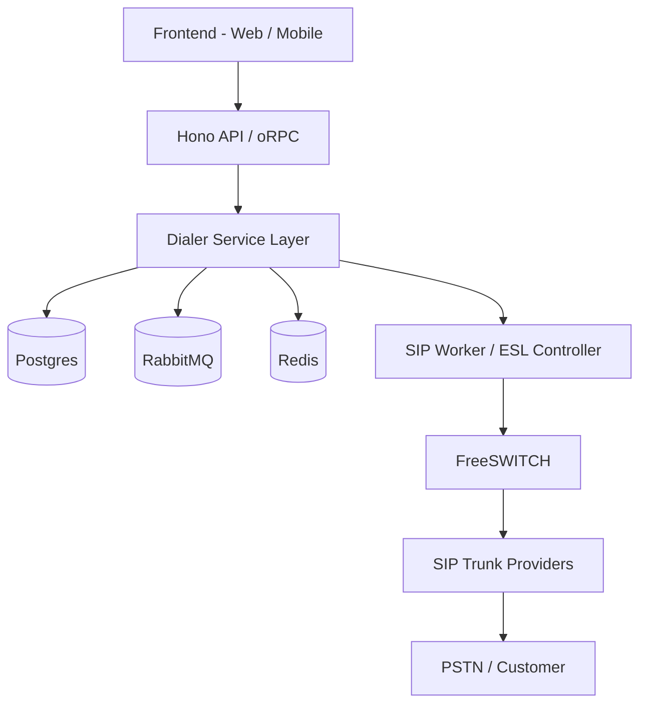
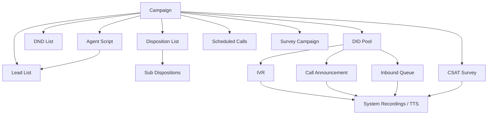
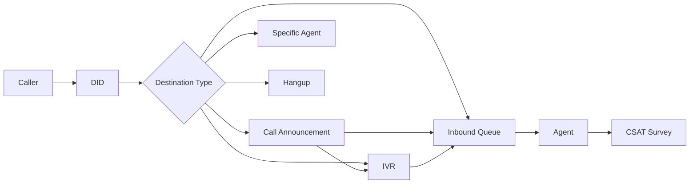
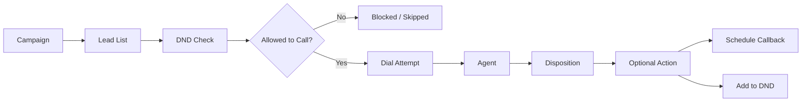

# Work Holo Dialer — Detailed Product Documentation

## 1. Document Purpose

This document defines the **detailed product behavior** for the Work Holo Dialer system.  
It is written as a **feature specification** for product, design, QA, and engineering teams.

This document intentionally focuses on:

- product behavior
- settings and configuration options
- runtime behavior
- validations and constraints
- dependencies between features
- phase-wise rollout

This document intentionally does **not** cover:

- database schema
- service or worker code
- API payload design
- internal implementation details

The Work Holo Dialer is designed as a **multi-tenant communication workflow system** in which a campaign orchestrates multiple reusable resources such as DID numbers, IVRs, inbound queues, lead lists, disposition lists, agent scripts, CSAT surveys, and audio assets.

---

## 2. Reading Guide

To keep this document easy to understand, each feature follows the same structure:

1. **Purpose** — what the feature exists for  
2. **Where it fits** — how it interacts with the rest of the system  
3. **Settings Reference** — every important configuration option  
4. **Runtime Behavior** — what happens when the feature is actually used  
5. **Validation Rules** — product-level constraints and guardrails  
6. **Phase Plan** — which parts ship early vs later  

---

## 3. Design Principles

### 3.1 Reusable Resource Model

Most features in the dialer are not one-off configuration fragments.  
They are reusable organization-level resources.

Examples:

- one inbound queue can be used by multiple DIDs or IVRs
- one disposition list can be used by multiple campaigns
- one system recording can be used by IVR, queue, announcements, and surveys
- one agent script can be reused across multiple campaigns

### 3.2 Campaign as Orchestrator

A campaign is the orchestration layer that references reusable resources.

A campaign should ideally not own all configuration directly.  
Instead, it links to:

- DID
- lead list
- inbound queue
- disposition list
- DND list
- agent script
- CSAT survey

### 3.3 Multi-Tenant Isolation

All resources are scoped to a single organization unless explicitly stated otherwise.

- platform level: DID procurement, trunk/provider integrations
- organization level: resource configuration and usage

### 3.4 Phase-Oriented Delivery

The system is intentionally split into phases.

- **early phases** focus on operationally essential features
- **later phases** add advanced controls, UX improvements, and intelligence

### 3.5 Implementation-Agnostic Product Spec

Wherever this document uses words like “must”, “should”, or “can”, those are product behavior expectations, not implementation instructions.

---

## 4. High-Level Architecture

### 4.1 End-to-End System View



### 4.2 Logical Product Architecture



### 4.3 Inbound Flow



### 4.4 Outbound Flow



---

## 5. Phase Summary

| Phase | Focus | Theme |
|---|---|---|
| Phase 1 | Core setup and minimal execution | foundational operations |
| Phase 2 | Essential usability and automation | practical completeness |
| Phase 3 | Structured workflows and advanced control | operational maturity |
| Phase 4 | UX and optimization | scale and efficiency |
| Phase 5 | Differentiators and intelligence | product advantage |

---

## 6. Resource Dependency Summary

| Feature | Organization-Level Resource | Can Be Reused | Can Be Linked to Campaign | Phase Starts |
|---|---|---:|---:|---|
| DID Pool | Yes | Yes | Yes | 1 |
| System Recordings | Yes | Yes | Indirectly | 1 |
| TTS | Yes | Yes | Indirectly | 3 |
| IVR | Yes | Yes | Indirectly | 2 |
| Call Announcement | Yes | Yes | Indirectly | 2 |
| Inbound Queue | Yes | Yes | Yes | 1 |
| Lead List | Yes | Yes | Yes | 1 |
| Disposition List | Yes | Yes | Yes | 1 |
| Sub Dispositions | Within disposition list | Yes | Yes | 3 |
| DND List | Yes | Yes | Yes | 1 |
| Agent Script | Yes | Yes | Yes | 1 |
| CSAT Survey | Yes | Yes | Yes | 2 |
| Survey Campaign | Yes | Yes | Optional | 4 |
| Scheduled Calls | Operational object | N/A | Yes | 3 |
| Campaign | Yes | N/A | N/A | 1 |

---

# 7. DID Pool

## 7.1 Purpose

The DID Pool contains all phone numbers allocated to a single organization by the SaaS platform.  
A DID is both:

- an **inbound entry point**
- a configurable **routing identity**

The platform assigns DIDs to an organization, and the organization manages how each DID behaves.

## 7.2 Where It Fits

A DID can route to:

- specific agents
- an inbound queue
- an IVR
- a call announcement
- hangup

For the initial version already discussed, the minimum supported destinations are:

- specific agents
- inbound queue
- hangup

IVR and announcement become important once those features are introduced in later phases.

## 7.3 DID Settings Reference

| Setting | Description | Type | Required | Phase | Notes |
|---|---|---|---:|---|---|
| DID Number | The actual provisioned phone number assigned by the platform | system value | Yes | 1 | immutable for org users |
| Name | Friendly internal label for the DID | text | Yes | 1 | example: Sales Main Number |
| Description | Internal description of the DID | multiline text | No | 1 | example: Main inbound line for support |
| Destination Type | Defines where calls to this DID should go | select | Yes | 1 | agent, inbound queue, hangup; IVR and announcement later |
| Destination Target | The selected target resource for the chosen destination type | resource reference | Conditional | 1 | required if destination type is not hangup |
| Sticky Agent Enabled | Routes repeat callers back to the same agent where possible | toggle | No | 1 | later extended with time controls |
| Status | Controls whether this DID is active for routing | toggle/select | No | 2 | active, inactive, suspended |
| Default Inbound Recording | Optional pre-answer or pre-route recording | recording reference | No | 3 | if supported as part of routing flow |
| Tags / Labels | Optional internal categorization | multi-tag | No | 4 | useful for ops at scale |

## 7.4 Destination Behavior

### Specific Agents

The DID routes inbound calls directly to one or more selected agents.

Best used for:

- VIP lines
- dedicated account managers
- direct team routing
- low-volume specialist lines

### Inbound Queue

The DID routes calls into a shared inbound queue.

Best used for:

- support lines
- general inquiries
- callback handling
- sales teams

### Hangup

The DID answers or rejects according to telephony behavior and ends the call without further routing.

Best used for:

- temporarily disabled numbers
- parked numbers
- reserved numbers not yet in use

### IVR

Available from later phases.  
The DID routes callers to a multi-step keypad menu.

### Call Announcement

Available from later phases.  
The DID first plays an informational message and then routes further.

## 7.5 Runtime Behavior

1. Caller dials the DID
2. System identifies the organization and DID configuration
3. Sticky-agent logic is checked if enabled
4. DID destination logic is resolved
5. Call is routed to the configured target

## 7.6 Validation Rules

- Name must be unique enough for human operators to identify it clearly
- Destination type is mandatory
- Destination target is mandatory when destination type is not `hangup`
- Sticky agent cannot override a non-routable destination
- If destination target becomes invalid later, DID should surface a broken-configuration warning
- Users cannot use DIDs that are not assigned to their organization

## 7.7 Phase Plan

### Phase 1

- DID visibility
- name and description
- route to agent / queue / hangup
- sticky agent toggle

### Phase 2

- status control
- validation warnings
- better DID filtering

### Phase 3

- route to IVR / call announcement
- time-aware destination options

### Phase 4

- tagging, DID grouping, search UX

### Phase 5

- advanced DID routing rules
- provider-aware DID intelligence
- channel-aware DID usage

---

# 8. System Recordings

## 8.1 Purpose

System Recordings is the centralized audio asset library for the dialer.  
It stores reusable audio files that can be referenced from multiple features.

## 8.2 Where It Fits

This feature is used by:

- IVR prompts
- call announcements
- music on hold
- failover music
- callback threshold recordings
- callback hangup recordings
- CSAT prompts
- future voice workflows

## 8.3 Recording Settings Reference

| Setting | Description | Type | Required | Phase | Notes |
|---|---|---|---:|---|---|
| Recording Name | Friendly label for the audio asset | text | Yes | 1 | example: Support Hold Music |
| Description | Internal explanation of usage | multiline text | No | 1 | optional but recommended |
| Recording Source | How the audio is created | select | Yes | 1 | uploaded audio first; TTS later |
| Audio File | Uploaded audio file | file | Conditional | 1 | required for uploaded recordings |
| Recording Type | Optional categorization | select/tag | No | 2 | hold music, IVR prompt, announcement, survey |
| Language | Language of the audio | select | No | 2 | especially useful once TTS exists |
| Duration | Display-only metadata | system value | No | 1 | derived from file |
| Usage References | Where the recording is currently used | system value | No | 3 | helps change management |
| Status | Whether the recording is available for selection | toggle | No | 2 | active / archived |

## 8.4 Runtime Behavior

A recording itself does not execute logic.  
It is referenced by another feature at runtime.

Example:

- queue references a hold music recording
- IVR references a prompt recording
- CSAT survey references a question prompt

## 8.5 Validation Rules

- Recording name should be meaningful and easy to search
- Uploaded file must meet supported telephony format requirements
- Archived or deleted recordings must not silently break active flows
- If a recording is in use, the system should warn before deletion
- A recording selected in a flow must belong to the same organization

## 8.6 Phase Plan

### Phase 1

- upload recordings
- list, view, select, delete with usage warning

### Phase 2

- status control
- categorization and search

### Phase 3

- usage references and governance indicators

### Phase 4

- tags, folders, better asset organization

### Phase 5

- versioning
- approval workflows
- usage analytics

---

# 9. TTS (Text-to-Speech)

## 9.1 Purpose

TTS allows users to generate spoken audio from text instead of uploading a pre-recorded file.  
The generated audio becomes part of the reusable system recordings library.

## 9.2 Where It Fits

TTS is useful for:

- fast IVR prompt creation
- frequent message updates
- multilingual announcements
- temporary campaigns
- future personalized voice prompts

## 9.3 TTS Settings Reference

| Setting | Description | Type | Required | Phase | Notes |
|---|---|---|---:|---|---|
| TTS Name | Friendly name for the generated audio | text | Yes | 3 | becomes an asset in recordings |
| Description | Internal context for the TTS asset | multiline text | No | 3 | optional |
| TTS Type | Structure of generated speech | select | Yes | 3 | single TTS, multi-part TTS |
| TTS Message | The text to be converted into speech | rich text / text | Yes | 3 | can support placeholders later |
| Lead List Reference | Optional source for dynamic fields | resource reference | No | 3 | needed if placeholders are used |
| Language | Selected speech language | select | Yes | 3 | example: English, Hindi |
| Voice Type | Selected voice profile | select | Yes | 3 | male/female/voice family depending on provider |
| Preview | Preview the generated speech | action | No | 3 | before final save |
| Save as Recording | Stores generated output in recordings library | action | Yes | 3 | makes it reusable |
| Placeholder Support | Dynamic field insertion for personalized speech | toggle/feature | No | 5 | advanced mode |

## 9.4 TTS Type Behavior

### Single TTS

A single block of text becomes one audio output.

Best for:

- simple greetings
- hold messages
- short prompts
- announcements

### Multi-Part TTS

A structured speech asset composed of multiple chunks.

Best for:

- dynamic messages
- partially variable statements
- future personalized prompts
- more controlled speech composition

## 9.5 Runtime Behavior

1. User enters text
2. User selects language and voice
3. System generates preview/output
4. User saves it as a reusable recording
5. Other features reference it like any other recording

## 9.6 Validation Rules

- TTS name is mandatory
- language and voice must be selected
- empty text is not allowed
- dynamic placeholders should only be allowed if a valid lead field source is selected
- TTS output should be treated like any other recording for usage tracking

## 9.7 Phase Plan

### Phase 3

- single TTS
- multi-part TTS
- language and voice selection
- save as recording

### Phase 4

- improved preview and editing UX
- categorization

### Phase 5

- dynamic placeholders
- advanced template-based TTS
- personalized runtime speech

---

# 10. IVR

## 10.1 Purpose

IVR (Interactive Voice Response) is an inbound call-handling workflow that plays audio prompts and allows callers to navigate using keypad input.

It is one of the most important routing features in the system.

## 10.2 Product Model

Work Holo will support two IVR creation experiences:

- **Simple View** — form-based, easier for common menus
- **Graph View** — node-based flow builder, recommended long-term model

Both views configure the same underlying IVR resource.

## 10.3 Where It Fits

An IVR can be used as:

- the destination of a DID
- an intermediate routing layer after a call announcement
- a nested or sub-IVR in a larger call flow
- a reusable inbound routing asset

## 10.4 Core IVR Concepts

An IVR contains:

- one or more prompts
- one or more menu options
- rules for invalid input
- rules for no input / timeout
- one or more destinations
- optionally nested paths

## 10.5 IVR Settings Reference

| Setting | Description | Type | Required | Phase | Notes |
|---|---|---|---:|---|---|
| IVR Name | Friendly name of the IVR | text | Yes | 2 | example: Main Support IVR |
| Description | Internal explanation of the IVR | multiline text | No | 2 | useful for teams |
| Builder View | IVR creation mode | select | Yes | 3 | simple, graph |
| Entry Prompt Recording | Recording played when the IVR starts | recording reference | Yes | 2 | welcome prompt |
| Prompt Repeat Count | Number of times prompt/menu can be replayed | number | No | 2 | before fallback |
| Input Timeout Seconds | How long to wait for keypad input | number | Yes | 2 | no-input handling |
| Invalid Input Handling | What to do if caller presses unsupported key | select | Yes | 2 | replay, fallback, hangup |
| Invalid Input Recording | Recording played after invalid input | recording reference | No | 2 | optional |
| Invalid Input Retry Limit | Number of invalid attempts allowed | number | No | 2 | then fallback/hangup |
| No Input Handling | What to do when caller gives no input | select | Yes | 2 | replay, fallback, hangup |
| No Input Recording | Recording for timeout/no input | recording reference | No | 2 | optional |
| No Input Retry Limit | Number of timeout retries allowed | number | No | 2 | after limit, fallback |
| Default Fallback Destination | Destination used when retry flow is exhausted | destination | No | 2 | queue, IVR, agent, hangup |
| Allow Repeat Menu Key | Lets caller replay current menu | toggle | No | 3 | often mapped to a digit |
| Repeat Menu Key | The key that replays the menu | digit | Conditional | 3 | only if repeat enabled |
| Allow Go Back Key | Lets caller return to previous IVR level | toggle | No | 4 | nested IVR support |
| Go Back Key | The key that navigates back | digit | Conditional | 4 | only if enabled |
| Allow Exit Key | Lets caller exit current IVR path | toggle | No | 4 | useful in complex flows |
| Exit Key | Key for exit behavior | digit | Conditional | 4 | only if enabled |
| Status | Whether the IVR can be used in live routing | toggle/select | No | 2 | active/inactive |
| Version Label | Optional human-readable IVR version | text | No | 4 | helpful for change tracking |

## 10.6 Menu Option Settings

Each IVR node/menu can have multiple options.

| Setting | Description | Type | Required | Phase | Notes |
|---|---|---|---:|---|---|
| Input Key | DTMF key the caller presses | digit / symbol | Yes | 2 | usually 0–9, optionally * and # |
| Option Label | Internal label for the option | text | No | 2 | not spoken; for admins |
| Option Prompt Fragment | Spoken meaning of the option | text | No | 2 | example: Press 1 for sales |
| Destination Type | Where this option routes | select | Yes | 2 | queue, agent, IVR, announcement, hangup |
| Destination Target | Chosen resource for the destination | reference | Conditional | 2 | required unless hangup |
| Option Priority | UI ordering of option listing | number | No | 3 | useful in graph builder |
| Enable Option | Whether the option is active | toggle | No | 3 | useful during maintenance |

## 10.7 Graph View Node Types

In graph mode, the IVR can be built using reusable node types.

| Node Type | Purpose | Phase |
|---|---|---|
| Start Node | Entry into the IVR flow | 3 |
| Prompt Node | Plays a recording / collects input | 3 |
| Menu Node | Maps keypad options to next steps | 3 |
| Queue Node | Routes to inbound queue | 3 |
| Agent Node | Routes to specific agent(s) | 3 |
| Sub-IVR Node | Routes to another IVR | 3 |
| Announcement Node | Plays an informational message | 3 |
| Hangup Node | Terminates the call | 3 |
| Fallback Node | Handles invalid or exhausted branches | 3 |

## 10.8 Runtime Behavior

### Standard Flow

1. Caller reaches the IVR
2. Entry prompt is played
3. System waits for keypad input
4. Caller input is matched against configured options
5. Matching destination is executed

### Invalid Input Flow

1. Caller presses unsupported key
2. Invalid-input behavior is triggered
3. System may replay, route to fallback, or hang up

### No Input Flow

1. Caller does not provide input within timeout
2. No-input behavior is triggered
3. System may replay, route to fallback, or hang up

### Nested Flow

1. Caller selects an option whose destination is another IVR
2. Current IVR passes control to the next IVR node/resource
3. Call continues in the new branch

## 10.9 Validation Rules

- IVR name is mandatory
- entry prompt is mandatory
- timeout must be positive
- duplicate input keys in the same menu are not allowed
- fallback destinations must reference valid resources
- if repeat/back/exit keys are enabled, those keys must not clash with active menu options unless intentionally allowed
- an active IVR should not contain unreachable required nodes in graph view
- deleting an IVR that is used by a live DID should require warning/confirmation

## 10.10 UX Expectations

### Simple View

Best for:

- short menus
- small teams
- low-complexity routing

### Graph View

Best for:

- multi-level routing
- complex inbound operations
- future extensibility
- visual debugging and change management

## 10.11 Phase Plan

### Phase 2

- simple IVR
- entry prompt
- DTMF options
- invalid/no-input handling
- queue/agent/hangup destinations

### Phase 3

- graph view builder
- nested IVR support
- announcement nodes
- reusable node architecture

### Phase 4

- back/exit/repeat controls
- version labels
- testing/simulation UX

### Phase 5

- conditional routing
- caller-history-aware routing
- advanced diagnostics
- AI-assisted IVR recommendations

---

# 11. Call Announcement

## 11.1 Purpose

Call Announcement is an automated voice message that plays after a call is received and before the call is routed further.

It is used to communicate information without agent intervention.

## 11.2 Example Use Cases

- promotion announcements
- business-hour notices
- service updates
- compliance disclosures
- queue expectation messaging

## 11.3 Announcement Settings Reference

| Setting | Description | Type | Required | Phase | Notes |
|---|---|---|---:|---|---|
| Announcement Name | Friendly internal label | text | Yes | 2 | example: Holiday Notice |
| Description | Internal explanation | multiline text | No | 2 | optional |
| Recording | The message to play | recording reference | Yes | 2 | uploaded or TTS-generated |
| Playback Mode | How the message plays | select | Yes | 2 | play once; repeat later if needed |
| Post-Announcement Destination Type | Where the call goes next | select | Yes | 2 | queue, IVR, agent, hangup |
| Post-Announcement Destination Target | Selected destination | resource reference | Conditional | 2 | required unless hangup |
| Allow Skip | Lets caller skip the message | toggle | No | 4 | future UX enhancement |
| Skip Key | Key used to skip | digit | Conditional | 4 | only if skip enabled |
| Status | Whether the announcement is available | toggle/select | No | 2 | active/inactive |

## 11.4 Runtime Behavior

1. Caller reaches the announcement step
2. Recording is played
3. After playback, the configured destination is executed

## 11.5 Validation Rules

- recording is mandatory
- post-announcement destination is mandatory unless action is hangup
- skip key cannot collide with another active input in the same routing context if it shares the same menu layer
- deleting a recording in use should warn users

## 11.6 Phase Plan

### Phase 2

- single recording
- play once
- route to IVR/queue/agent/hangup

### Phase 4

- skip option
- better asset organization

### Phase 5

- conditional announcements
- time-based announcements
- caller-aware announcements

---

# 12. Inbound Queue

## 12.1 Purpose

Inbound Queue distributes incoming calls to agents according to configured routing logic and fallback behavior.

This is the core inbound call distribution layer.

## 12.2 Where It Fits

Inbound queues can be reached from:

- DID
- IVR
- call announcement
- failover from another queue
- callback routing
- future scheduled callback execution

## 12.3 Queue Settings Reference

### Basic Settings

| Setting | Description | Type | Required | Phase | Notes |
|---|---|---|---:|---|---|
| Name | Name of the queue | text | Yes | 1 | example: Customer Support Queue |
| Description | Internal description | multiline text | No | 1 | example: Handles priority support calls |
| Ring Strategy | How calls are assigned | select | Yes | 1 | random, fewest calls, longest wait time |
| Queue Timeout (Seconds) | Maximum time a caller can remain in queue | number | Yes | 2 | triggers failover or exit behavior |
| Agent Ring Timeout (Seconds) | Time each agent gets before moving to next eligible agent | number | Yes | 2 | per attempt |
| Music On Hold | Audio played while waiting | recording reference | No | 2 | can be music or spoken message |
| Failover Destination | Where to route if no agent is available or queue times out | destination | No | 2 | queue, voicemail, IVR, agent, hangup |
| Failover Music | Music/message used during failover wait | recording reference | No | 2 | optional |

### Sticky Agent and Repeat Caller

| Setting | Description | Type | Required | Phase | Notes |
|---|---|---|---:|---|---|
| Sticky Agent Enabled | Try to reconnect the caller to the same previous agent | toggle | No | 3 | queue-level control |
| Sticky Agent Time | Lookback period for matching the previous agent | number | Conditional | 3 | example: 3 |
| Sticky Agent Time Format | Unit for sticky lookback | select | Conditional | 3 | days or hours |
| Repeat Caller Alert Enabled | Enables repeat caller awareness | toggle | No | 3 | alerts agents/admins |
| Repeat Caller Window | Time period used to mark caller as repeat | number | Conditional | 3 | example: 7 |
| Repeat Caller Window Unit | Unit for repeat caller period | select | Conditional | 3 | usually days |

### Agent Assignment

| Setting | Description | Type | Required | Phase | Notes |
|---|---|---|---:|---|---|
| Assigned Agents | Agents eligible to receive calls from this queue | multi-select | Yes | 1 | at least one recommended |
| Agent Priority Enabled | Enables priority-based queue routing | toggle | No | 3 | per queue |
| Agent Priority Mapping | Priority assigned to each mapped agent | number per agent | Conditional | 3 | 30 highest, 1 lowest |

### Reporting Settings

| Setting | Description | Type | Required | Phase | Notes |
|---|---|---|---:|---|---|
| SLA Duration (Seconds) | Target answer time threshold for reporting | number | No | 2 | example: 30 seconds |
| Queue Status | Active/inactive queue state | toggle/select | No | 2 | useful operationally |

### Callback Settings

| Setting | Description | Type | Required | Phase | Notes |
|---|---|---|---:|---|---|
| Callback Enabled | Enables in-queue callback offering | toggle | No | 2 | recommended for support queues |
| Threshold Time (Seconds) | Wait time after which callback option becomes available | number | Conditional | 2 | example: 60 |
| Callback DTMF | Key caller presses to request callback | digit | Conditional | 2 | example: 5 |
| Threshold Recording | Recording played when callback option is offered | recording reference | Conditional | 2 | example: Press 5 to request callback |
| Call Hangup Recording | Recording played before disconnect after callback request | recording reference | Conditional | 2 | confirms callback capture |
| Callback Routing Mode | Determines who handles callback later | select | No | 3 | same agent, any agent, callback queue |
| Auto-Dial Callback | Automatically place callback at scheduled time | toggle | No | 3 | later automation |

## 12.4 Ring Strategy Behavior

### Random

Eligible agents are selected randomly.

Best for:

- basic load distribution
- low-complexity teams

### Fewest Calls

The next call goes to the agent with the fewest completed/handled calls in the relevant measurement context.

Best for:

- fairness
- balancing workload

### Longest Wait Time

The next call goes to the agent who has been waiting the longest since the last call.

Best for:

- reducing idle imbalance
- common contact-center distribution

## 12.5 Runtime Behavior

1. Caller enters queue
2. Queue checks agent eligibility
3. Ring strategy chooses candidate agent
4. Candidate agent rings for configured agent ring timeout
5. If unanswered, next eligible route is attempted
6. If caller waits beyond queue timeout, failover logic is triggered
7. If callback is enabled and threshold time is reached, caller can request callback

## 12.6 Validation Rules

- queue name is mandatory
- ring strategy is mandatory
- if callback is enabled, threshold time and callback DTMF must be provided
- callback DTMF must not clash with another keypad interaction at the same queue context
- if sticky agent is enabled, sticky time and time format are required
- if agent priority is enabled, mapped agents must have defined priorities
- if failover destination is configured, target must be valid
- queue should warn if no agents are assigned
- active queue with zero valid agents should surface a broken-configuration warning

## 12.7 Phase Plan

### Phase 1

- name, description
- ring strategy
- assigned agents

### Phase 2

- queue timeout
- agent ring timeout
- music on hold
- failover destination
- callback threshold flow
- SLA duration

### Phase 3

- sticky agent with time window
- repeat caller detection
- agent priorities
- callback routing mode
- auto-dial callback

### Phase 4

- queue visibility UX
- estimated wait time
- callback queues

### Phase 5

- skill-based routing
- concurrency controls
- adaptive queue logic

---

# 13. Lead List

## 13.1 Purpose

A Lead List is a reusable collection of callable leads used by outbound campaigns.

It is the primary audience source for dialer campaigns.

## 13.2 Product Role

Lead lists help organizations:

- import and structure leads
- map custom fields
- segment outreach targets
- reuse the same audience across multiple campaigns
- export and review lead data

## 13.3 Lead List Settings Reference

### List-Level Settings

| Setting | Description | Type | Required | Phase | Notes |
|---|---|---|---:|---|---|
| Lead List Name | Friendly name of the list | text | Yes | 1 | example: Renewal Leads |
| Description | Internal description | multiline text | No | 1 | optional |
| Shared / Availability Scope | Controls who can use the list | select | No | 3 | org-wide, team-scoped, etc. |
| List Status | Whether the list is active | toggle/select | No | 2 | active/inactive |
| Clone Allowed | Whether list can be duplicated | action/control | No | 2 | UX and governance feature |

### Field Mapping and Structure

| Setting | Description | Type | Required | Phase | Notes |
|---|---|---|---:|---|---|
| Standard Fields | Base lead fields available in every list | system schema | Yes | 1 | phone number, name; more optional |
| Custom Fields | User-defined extra lead fields | configurable fields | No | 2 | campaign-specific data |
| Import Mapping | Mapping from uploaded CSV columns to fields | mapping UI | Yes | 2 | required during bulk upload |
| Field Validation Type | Input validation per field | select | No | 2 | alphanumeric, numeric, date, etc. |
| External Reference ID | Optional external ID | text | No | 2 | useful for CRM sync |

### Lead Upload Settings

| Setting | Description | Type | Required | Phase | Notes |
|---|---|---|---:|---|---|
| Upload Mode | How leads are added | select | Yes | 1 | manual or CSV |
| Download Sample CSV | Template download for import | action | No | 2 | helps formatting |
| Duplicate Handling | Behavior when duplicates are found | select | No | 2 | skip, overwrite, clone |
| Duplicate Check Scope | Where duplicate detection is applied | select | No | 2 | this list, all lists |
| Upload Review Step | Review imported data before final save | action/flow | No | 2 | strongly recommended |
| Upload Logs | History of list uploads | system log | No | 2 | troubleshooting and audit |

### Bulk Management

| Setting | Description | Type | Required | Phase | Notes |
|---|---|---|---:|---|---|
| Export Leads | Download current list data | action | No | 2 | CSV export |
| Clear List | Remove leads but keep list container | action | No | 2 | destructive but common |
| Clone List | Copy list configuration and/or leads | action | No | 2 | reuse-oriented |
| Master Upload | Add uploaded leads to multiple or all lists | action/flow | No | 4 | advanced bulk operation |
| Master Delete | Remove matching leads from multiple or all lists | action/flow | No | 4 | advanced cleanup |

## 13.4 Default Lead Fields

The system should support at least the following baseline fields:

- Phone Number
- Name
- Email ID
- Address
- Company Name
- Alternate Phone Number
- External Reference ID
- Custom Fields

Not all fields need to be required in every list, but **Phone Number** is the minimum mandatory field for dialer use.

## 13.5 Duplicate Handling Behavior

### Skip

If a lead already exists under the active duplicate-check rule, the new row is ignored.

### Overwrite

If a lead already exists under the active duplicate-check rule, the existing row is updated using uploaded values.

### Clone

If a lead already exists, the same phone number can exist again as a separate record.

## 13.6 Runtime Behavior

Lead lists are primarily used in campaign execution.

Typical flow:

1. campaign links to one or more lead lists
2. system reads callable leads
3. DND and status rules are applied
4. agent receives lead and dynamic data
5. outcomes are recorded back against the lead

## 13.7 Validation Rules

- lead list name is mandatory
- phone number field must exist
- duplicate handling should be selected or a default should apply during upload
- overwrite should only be allowed when a deterministic duplicate rule exists
- field mappings must be resolved before upload finalization
- deleting a lead list that is attached to an active campaign should show a warning
- master delete should not silently remove leads currently in active call attempts

## 13.8 Phase Plan

### Phase 1

- create list
- basic fields
- CSV upload
- view leads
- delete list

### Phase 2

- duplicate handling
- field mapping
- upload logs
- export, clear, clone

### Phase 3

- lead status, lead locking, lead timeline integration

### Phase 4

- master upload and master delete
- team/shared availability controls

### Phase 5

- smart duplicate detection
- advanced segmentation
- lead scoring and intelligent prioritization

---

# 14. Disposition List

## 14.1 Purpose

A Disposition List defines the call outcomes that agents can select after interacting with a lead or caller.

It standardizes post-call classification and drives follow-up workflow.

## 14.2 Product Role

A disposition list is used to:

- capture call outcome consistently
- trigger operational actions
- support reporting
- support retry and callback logic
- drive DND workflows

## 14.3 Disposition List Settings Reference

### List-Level Settings

| Setting | Description | Type | Required | Phase | Notes |
|---|---|---|---:|---|---|
| Disposition List Name | Friendly name of the list | text | Yes | 1 | example: Sales Outcomes |
| Description | Internal explanation | multiline text | No | 1 | optional |
| Availability | Where the list can be used | select | No | 2 | org-wide / campaign-scoped later |
| Status | Whether list is enabled | toggle/select | No | 2 | active/inactive |
| Number of Statuses | Display-only count of child statuses | system value | No | 1 | useful in admin views |

### Disposition Status Settings

| Setting | Description | Type | Required | Phase | Notes |
|---|---|---|---:|---|---|
| Disposition Name | User-facing outcome label | text | Yes | 1 | example: Callback Requested |
| Disposition Code | Structured internal code | text | Yes | 1 | example: CALLBACK |
| Description | Optional notes about when to use | multiline text | No | 2 | helps training |
| Primary Action | System action triggered by the disposition | select | No | 2 | none, schedule callback, add to DND |
| Status Enabled | Whether this disposition can be selected | toggle | No | 2 | useful operationally |
| Notes Required | Whether agent must enter notes | toggle | No | 4 | UX and compliance |
| Callback Data Required | Whether callback metadata is mandatory | toggle | No | 4 | when used with callback action |
| Disposition Group | Higher-level outcome grouping | select | No | 4 | connect, non-connect, callback, etc. |

### Bulk Creation Settings

| Setting | Description | Type | Required | Phase | Notes |
|---|---|---|---:|---|---|
| Add Manually | Add status one by one | action | Yes | 1 | initial path |
| Upload via CSV | Bulk import statuses | action | No | 2 | scalable setup |
| Download Sample CSV | Template download for bulk import | action | No | 2 | useful admin feature |
| Upload Review | Review imported statuses before save | action/flow | No | 2 | recommended |

## 14.4 Primary Action Behavior

### None

Disposition only classifies the outcome.

### Schedule Callback

Selecting the disposition starts the callback workflow.

Examples:

- Callback Requested
- Try Again Later
- Spoke, Requested Follow-Up

### Add to DND

Selecting the disposition adds the lead or caller number to the DND list.

Examples:

- Do Not Call
- Customer Requested Removal
- DND Requested

## 14.5 Runtime Behavior

1. Agent finishes or exits call interaction
2. Agent selects a disposition
3. If the disposition has a primary action, the action flow is triggered
4. Lead outcome is stored for reporting and follow-up

## 14.6 Validation Rules

- list name is mandatory
- each disposition status must have name and code
- codes should be unique within the list
- if primary action is callback, callback flow prerequisites should be satisfied
- if primary action is DND, phone number must exist and be eligible for DND action
- disabling a disposition currently used by a live campaign should show impact warning

## 14.7 Phase Plan

### Phase 1

- create disposition list
- add name and code
- use in campaigns

### Phase 2

- primary actions
- CSV upload
- status enable/disable

### Phase 4

- notes required
- callback data required
- disposition grouping

### Phase 5

- advanced workflow chaining
- recommendation engine
- AI-assisted dispositioning

---

# 15. Sub Dispositions

## 15.1 Purpose

Sub Dispositions extend a parent disposition with more specific classification.

They add clarity and reporting depth without forcing a flat, overly large list of top-level outcomes.

## 15.2 Example

```text
Not Interested
- Too Expensive
- Not Relevant
- Already Using Competitor
```

## 15.3 Sub Disposition Settings Reference

| Setting | Description | Type | Required | Phase | Notes |
|---|---|---|---:|---|---|
| Parent Disposition | The top-level outcome under which sub dispositions live | reference | Yes | 3 | required |
| Sub Disposition Name | Specific child outcome label | text | Yes | 3 | example: Too Expensive |
| Sub Disposition Code | Structured child code | text | Yes | 3 | example: NI_PRICE |
| Description | Optional usage guidance | multiline text | No | 3 | training support |
| Enabled | Whether this sub disposition is selectable | toggle | No | 3 | operational flexibility |
| Mandatory Selection | Whether agent must choose a child once parent is chosen | toggle | No | 3 | parent-level control typically |
| Child Action | Optional child-specific action | select | No | 5 | advanced behavior later |

## 15.4 Selection Behavior

### Parent Only

Agent selects the parent disposition only.

### Parent + Child

Agent first selects the parent, then selects a child sub disposition.

### Mandatory Child Mode

Once a parent with mandatory child selection is chosen, the call cannot be finalized until a valid sub disposition is selected.

## 15.5 Recommended Product Rule

In early versions, actions should be attached to the **parent disposition**, while sub dispositions are used for classification only.

This keeps the system simple and prevents highly fragmented workflow logic.

## 15.6 Runtime Behavior

1. Agent selects parent disposition
2. If child selection is enabled or mandatory, sub-disposition options appear
3. Agent selects child
4. Final outcome stores both parent and child

## 15.7 Validation Rules

- sub disposition must belong to a valid parent
- child codes should be unique under a parent or within the full list, depending on product rule
- if child selection is mandatory, at least one active child must exist
- if child-specific actions are later supported, conflicting parent/child action logic should not be allowed silently

## 15.8 Phase Plan

### Phase 3

- create sub dispositions
- parent → child selection UI
- mandatory/optional child selection

### Phase 4

- improved reporting and filters

### Phase 5

- child-specific actions
- analytics-driven suggestions

---

# 16. DND List

## 16.1 Purpose

The DND (Do Not Disturb) List is the organization-level suppression list of phone numbers that must not be contacted.

It is a compliance and customer-preference safeguard.

## 16.2 Product Role

Before any outbound communication, the system must check the DND list.

This should apply to:

- calls
- callbacks
- scheduled outbound calls
- future messaging channels

## 16.3 DND List Settings Reference

### Entry-Level Settings

| Setting | Description | Type | Required | Phase | Notes |
|---|---|---|---:|---|---|
| Phone Number | Number to block | text/phone | Yes | 1 | primary identifier |
| Source | How entry was added | select/system value | No | 1 | manual, disposition, import, API |
| Reason | Why number was added | text | No | 2 | customer request, compliance, internal |
| Added On | Timestamp of DND creation | system value | No | 1 | audit use |
| Added By | User/system that created the entry | system value | No | 2 | audit use |
| Status | Whether the DND entry is active | toggle/select | No | 2 | active/inactive |
| Scope | What area the DND entry blocks | select | No | 4 | org-wide, campaign-specific |
| Channel Scope | Which channels are blocked | multi-select | No | 5 | call, SMS, WhatsApp |
| Expiry | Optional end time for suppression | datetime | No | 5 | temporary DND |

### List Operations

| Setting | Description | Type | Required | Phase | Notes |
|---|---|---|---:|---|---|
| Add Manually | Add one number directly | action | Yes | 1 | initial capability |
| Upload DND Leads (CSV) | Bulk import suppression list | action | No | 1 | operationally essential |
| Download Sample CSV | Import template | action | No | 2 | admin UX |
| View DND Entries | Search/filter blocked numbers | view | Yes | 1 | necessary for operations |
| Delete / Remove Entry | Remove number from DND list | action | No | 1 | with confirmation |
| Update Entry | Edit metadata like reason or status | action | No | 2 | optional but useful |

## 16.4 Runtime Behavior

1. System selects a candidate outbound number
2. DND check runs
3. If number is in active DND scope, communication is blocked
4. Lead is skipped, marked, or surfaced according to campaign logic

## 16.5 Integration Behavior

### From Dispositions

A disposition like “DND Requested” can add the number to the DND list automatically.

### From Imports

Organizations can upload suppression files in bulk.

### From Admins

Users can manually add or remove DND entries.

## 16.6 Validation Rules

- phone number is mandatory
- duplicate DND entries should be handled consistently
- removing a DND entry should require confirmation
- DND checks must run before callback execution as well
- future channel-scoped DND must not be treated as global unless configured

## 16.7 Phase Plan

### Phase 1

- manual add
- CSV upload
- outbound blocking
- remove entry

### Phase 2

- reason, source, audit visibility

### Phase 4

- scoped DND

### Phase 5

- channel-based DND
- temporary DND
- advanced compliance controls

---

# 17. Agent Script

## 17.1 Purpose

Agent Script provides guided text to the agent during the call.

It improves consistency, training, confidence, and conversation quality.

## 17.2 Product Role

Agent scripts are especially useful for:

- sales intros
- verification language
- compliance statements
- objection handling
- structured follow-up flows

## 17.3 Script Settings Reference

| Setting | Description | Type | Required | Phase | Notes |
|---|---|---|---:|---|---|
| Script Name | Friendly name of the script | text | Yes | 1 | example: Renewal Intro Script |
| Description | Internal explanation | multiline text | No | 1 | optional |
| Lead List Reference | Which lead schema provides dynamic fields | resource reference | No | 2 | required if dynamic fields used |
| Script Body | Main script content shown to agent | rich text / text | Yes | 1 | static first, dynamic later |
| Dynamic Field Insertion | Insert lead field placeholders | editor action | No | 2 | example: {{Customer Name}} |
| Availability / Assignment | Where the script can be used | select | No | 2 | org-wide, campaign-linked, team-linked |
| Status | Whether script is active | toggle/select | No | 2 | active/inactive |
| Clone Script | Duplicate script for reuse | action | No | 2 | useful at scale |

## 17.4 Dynamic Field Behavior

When a valid lead field source is selected, the script editor can insert placeholders such as:

- customer name
- company name
- city
- product interest
- external reference ID

At runtime, placeholders are resolved using the active lead record.

## 17.5 Runtime Behavior

1. campaign assigns or exposes the script
2. agent receives the live lead
3. script panel opens with content
4. placeholders resolve with lead-specific values
5. agent follows the script during the call

## 17.6 Validation Rules

- script name and body are mandatory
- if dynamic fields are used, a valid field source should be defined
- deleted lead fields should not silently break existing script content
- scripts attached to active campaigns should warn before destructive edits

## 17.7 Phase Plan

### Phase 1

- static script creation
- show in agent panel

### Phase 2

- dynamic fields
- availability/assignment
- cloning

### Phase 4

- better editor UX
- formatting improvements
- mandatory sections

### Phase 5

- conditional blocks
- stage-aware scripts
- AI coaching and suggestions

---

# 18. CSAT Survey

## 18.1 Purpose

CSAT Survey captures customer satisfaction feedback after a call interaction.

## 18.2 Product Role

CSAT helps organizations measure:

- service quality
- queue quality
- agent quality
- caller satisfaction trends

## 18.3 CSAT Settings Reference

| Setting | Description | Type | Required | Phase | Notes |
|---|---|---|---:|---|---|
| Survey Name | Friendly survey label | text | Yes | 2 | example: Post-Call Support Rating |
| Description | Internal context | multiline text | No | 2 | optional |
| Survey Prompt Recording | Audio asking customer for rating | recording reference | Yes | 2 | example: Rate 1 to 5 |
| Rating Scale | Set of accepted rating inputs | select | Yes | 2 | 1–5 initially |
| Invalid Input Handling | What happens on unsupported key | select | Yes | 2 | replay, skip, end |
| Invalid Input Retry Limit | Number of invalid retries | number | No | 2 | before ending |
| No Input Handling | What happens if caller gives no input | select | Yes | 2 | replay, end, skip |
| No Input Retry Limit | Number of no-input retries | number | No | 2 | before exit |
| Completion Recording | Optional thank-you message after answer | recording reference | No | 2 | nice UX |
| Status | Whether survey can be used | toggle/select | No | 2 | active/inactive |
| Multi-Question Enabled | Enables more than one question | toggle | No | 4 | advanced mode |
| Question Sequence | Ordered survey questions | question collection | Conditional | 4 | when multi-question enabled |

## 18.4 Runtime Behavior

1. call ends or reaches survey trigger
2. survey prompt plays
3. caller presses a rating key
4. system records response
5. optional thank-you message plays
6. survey ends

## 18.5 Data Captured

At minimum, each CSAT response should capture:

- phone number
- rating
- timestamp
- call reference
- campaign reference if applicable
- queue reference if applicable
- agent reference if applicable

## 18.6 Validation Rules

- survey name and prompt are mandatory
- rating scale must be defined
- if multi-question mode is enabled later, at least one active question must exist
- invalid/no-input handling must be defined
- completion recording is optional

## 18.7 Phase Plan

### Phase 2

- single-question DTMF survey
- 1–5 rating
- retry and timeout handling

### Phase 4

- multi-question surveys
- richer reporting
- agent-level and queue-level dashboards

### Phase 5

- SMS / WhatsApp follow-up surveys
- conditional surveys
- advanced scoring models

---

# 19. Survey Campaign

## 19.1 Purpose

Survey Campaign is used to collect structured responses from respondents through a questionnaire-based workflow.

It is broader than CSAT.

- **CSAT Survey** = short post-call satisfaction capture
- **Survey Campaign** = structured questionnaire for outreach, feedback, research, or data collection

## 19.2 Product Role

Survey Campaign can be used for:

- customer feedback programs
- service audits
- market surveys
- outbound data collection
- form-style response capture
- trackable response flows

## 19.3 Survey Campaign Settings Reference

### Campaign-Level Settings

| Setting | Description | Type | Required | Phase | Notes |
|---|---|---|---:|---|---|
| Survey Campaign Name | Friendly campaign name | text | Yes | 4 | example: Product Feedback Survey |
| Description | Internal campaign description | multiline text | No | 4 | optional |
| Survey Status | Whether survey campaign is active | toggle/select | No | 4 | draft, active, paused, archived |
| Linked Lead Source | Lead list or contact source used for respondents | resource reference | No | 4 | depends on use case |
| Launch Mode | How the survey is triggered | select | Yes | 4 | outbound voice, trackable URL, assisted collection |
| Completion Action | What happens after final answer | select | No | 4 | thank-you, redirect, end |
| Reporting Owner | Team or user responsible for results | reference | No | 4 | useful operationally |

### Question Settings

| Setting | Description | Type | Required | Phase | Notes |
|---|---|---|---:|---|---|
| Question Text | The question shown or asked | text | Yes | 4 | core question body |
| Question Type | Input style used for the response | select | Yes | 4 | dropdown, checkbox, short answer, date, datetime |
| Required | Whether the question must be answered | toggle | No | 4 | important for form completeness |
| Option 1–N | Choices for structured questions | repeated field | Conditional | 4 | needed for dropdown/checkbox |
| Valid Input Type | Input validation rule | select | No | 4 | alphanumeric, numeric, etc. |
| Min Length | Minimum allowed input size | number | No | 4 | useful for text responses |
| Max Length | Maximum allowed input size | number | No | 4 | useful for text responses |
| Display Order | Sequence of the question | number | Yes | 4 | controls flow |
| Help Text | Extra explanation shown to respondent | text | No | 4 | optional |
| Branching Rule | Conditional next step based on answer | rule | No | 5 | advanced survey logic |

## 19.4 Question Type Guidance

### Dropdown

Single-choice answer from a predefined set.

### Checkbox

Multi-select answer where more than one option can be chosen.

### Short Answer

Free-text answer.

### Date

Date-only response.

### Datetime

Date + time response.

## 19.5 Runtime Behavior

Survey campaign runtime depends on launch mode.

### Outbound Voice / Assisted Flow

- respondent is contacted
- questions are asked or surfaced
- answers are collected sequentially

### Trackable URL Flow

- respondent opens a survey link
- questions are answered in form-style UI
- responses are stored against the survey campaign

## 19.6 Validation Rules

- survey campaign name is mandatory
- at least one question is required
- question types requiring options must define options
- min/max validation must make sense for the selected question type
- question order should be unique within the campaign
- branching rules should not create broken loops or dead ends once advanced logic exists

## 19.7 Phase Plan

### Phase 4

- basic survey campaign
- question definitions
- form-style responses
- simple completion logic

### Phase 5

- branching logic
- advanced survey analytics
- multichannel distribution
- trackable response optimization

---

# 20. Scheduled Calls

## 20.1 Purpose

Scheduled Calls allow an outbound call or follow-up call to be planned for a specific future date and time.

This is related to, but not identical with, callback dispositioning.

## 20.2 Scheduled Call vs Callback

### Callback

Usually created as the result of a disposition or queue callback request.

### Scheduled Call

Broader planned outbound engagement that may or may not originate from a disposition.

## 20.3 Scheduled Call Settings Reference

| Setting | Description | Type | Required | Phase | Notes |
|---|---|---|---:|---|---|
| Scheduled Call Title / Label | Friendly label for the planned call | text | No | 3 | optional but useful |
| Customer Name | Name of the contact or lead | text | Yes | 3 | required for usability |
| Customer Number | Number to be called | phone/text | Yes | 3 | mandatory |
| Scheduled Date and Time | Exact planned call time | datetime | Yes | 3 | key setting |
| Assigned To | Agent/user responsible for the call | user reference | Yes | 3 | same agent vs any agent supported later |
| Campaign Reference | Associated campaign if relevant | campaign reference | No | 3 | useful for reporting |
| Queue Reference | Queue associated with callback routing if applicable | queue reference | No | 3 | especially for inbound-origin callbacks |
| Notes | Context about why the call is scheduled | multiline text | No | 3 | very useful operationally |
| Reminder Enabled | Whether reminder should be sent before scheduled time | toggle | No | 3 | operational aid |
| Reminder Time | How long before the call reminder triggers | number | Conditional | 3 | usually minutes |
| Auto Dial | Whether the system should place the call automatically | toggle | No | 3 | later phase behavior in practice |
| Call End Time / Max Ring Window | How long the system should allow the attempt before marking it unanswered | number | No | 3 | optional control |
| Status | State of the scheduled call | select | No | 3 | scheduled, completed, missed, cancelled |
| Edit Allowed | Whether record can be changed before execution | action/control | No | 3 | UX support |

## 20.4 Runtime Behavior

### Manual Handling

1. scheduled time arrives
2. responsible agent sees the due call
3. agent initiates or handles the call manually

### Auto-Dial Handling

1. scheduled time arrives
2. system verifies DND, status, and routing prerequisites
3. call is placed automatically
4. result is stored against the scheduled call

## 20.5 Validation Rules

- customer number and scheduled date/time are mandatory
- scheduled date/time must be in the future at creation time
- if reminder is enabled, reminder time is required
- if queue reference is provided, queue must be valid
- if auto dial is enabled, campaign and routing prerequisites should be satisfied
- a scheduled call should not proceed if the number is in DND at execution time
- rescheduling should preserve history rather than silently replacing operational context

## 20.6 Phase Plan

### Phase 3

- create scheduled calls
- assign to agent
- due-time visibility
- reminder support
- optional queue linkage

### Phase 4

- better calendar/list UX
- edit/delete/reschedule workflows
- callback queue integration

### Phase 5

- automated conflict handling
- auto-dial optimization
- mobile and multichannel scheduling

---

# 21. Campaign

## 21.1 Purpose

Campaign is the central orchestration unit of the dialer.  
It combines reusable resources into an operational workflow.

## 21.2 Core Campaign Dependencies

For campaign creation, the following resources are required or strongly expected:

- DID number pool
- inbound queue
- disposition list
- DND list
- agent script
- CSAT survey
- lead list

Depending on phase and campaign type, some dependencies may be optional, but campaign should always validate what is necessary for the chosen mode.

## 21.3 Campaign Settings Reference

### Basic Settings

| Setting | Description | Type | Required | Phase | Notes |
|---|---|---|---:|---|---|
| Campaign Name | Friendly campaign label | text | Yes | 1 | example: April Renewal Campaign |
| Description | Internal description | multiline text | No | 1 | optional |
| Campaign Type | Type of campaign flow | select | Yes | 1 | initially dialer campaign; survey later |
| Status | Current lifecycle state | select | No | 2 | draft, active, paused, completed, archived |
| Active Hours | Time windows during which campaign can operate | schedule | No | 4 | useful compliance control |
| Timezone | Timezone used for campaign timing rules | select | No | 4 | relevant for schedule-sensitive work |

### Resource Linking

| Setting | Description | Type | Required | Phase | Notes |
|---|---|---|---:|---|---|
| Primary DID | DID used as campaign identity / callback target | DID reference | Yes | 1 | required for most dialer campaigns |
| Lead List | Audience source for campaign | lead list reference | Yes | 1 | at least one |
| Inbound Queue | Queue used for callback/inbound association | queue reference | Yes | 1 | campaign-linked inbound handling |
| Disposition List | Outcomes agents can use | disposition list reference | Yes | 1 | essential operational dependency |
| DND List | Suppression source used during dialing | DND reference | Yes | 1 | global org DND by default |
| Agent Script | Script shown during live calls | script reference | No | 1 | recommended even if not mandatory |
| CSAT Survey | Survey triggered after call | survey reference | No | 2 | depending on campaign type |
| Announcement / IVR Integration | Optional pre- or post-call flow references | resource reference | No | 3 | richer routing cases |

### Execution Controls

| Setting | Description | Type | Required | Phase | Notes |
|---|---|---|---:|---|---|
| Retry Policy | Defines how retryable outcomes are handled | rule set | No | 3 | based on disposition |
| Callback Policy | Defines callback ownership and automation | rule set | No | 3 | same agent / any agent / auto-dial |
| Multi-Lead Source Enabled | Allows more than one lead list | toggle | No | 4 | later expansion |
| Campaign Template | Save/load reusable campaign setup | action/feature | No | 4 | UX enhancement |
| Auto Validation | Check campaign readiness before activation | system behavior | Yes | 2 | highly recommended |
| Completion Rule | Defines when campaign is considered complete | select/rule | No | 4 | all leads exhausted, manual close, etc. |

## 21.4 Campaign Lifecycle

### Draft

Configuration is being created but campaign is not yet running.

### Active

Campaign is live and operational.

### Paused

Campaign is temporarily halted without deletion.

### Completed

Campaign is operationally finished.

### Archived

Campaign is preserved for reference but not operational.

## 21.5 Activation Checklist

Before a campaign is activated, the system should validate:

- required DID exists and is assigned
- lead list exists and has callable leads
- disposition list is valid
- queue is valid
- DND source is available
- any linked script/survey references are valid
- required operational dependencies are not broken

## 21.6 Runtime Behavior

1. campaign becomes active
2. campaign selects leads from lead list
3. DND rules are applied
4. agents call or receive leads according to campaign logic
5. dispositions drive follow-up actions
6. callbacks and surveys are triggered as applicable

## 21.7 Validation Rules

- campaign name and type are mandatory
- campaign cannot be activated with broken required dependencies
- deleting a required linked resource should show impact warnings
- active-hours logic should not allow dialing outside configured window once enabled
- if multi-lead mode exists, priority and exhaustion behavior must be defined

## 21.8 Phase Plan

### Phase 1

- create basic dialer campaign
- link DID, lead list, queue, disposition list, DND list, script

### Phase 2

- campaign status and readiness validation
- CSAT integration

### Phase 3

- retry policy
- callback policy
- scheduled calls integration

### Phase 4

- templates
- scheduling windows
- multi-lead list support
- completion rules

### Phase 5

- predictive optimization
- AI recommendations
- advanced orchestration logic

---

# 22. Global Runtime Rules

## 22.1 DND Enforcement

DND checks must run before:

- outbound dial attempts
- scheduled outbound calls
- callbacks
- future message triggers

## 22.2 Resource Integrity

If a live campaign references a broken resource, the system must surface a warning.

Examples:

- queue with no agents
- IVR missing required prompt
- script using deleted lead field
- campaign linked to inactive DID
- CSAT survey with no prompt

## 22.3 Safe Deletion

Resources in live use should not be silently deletable without warnings.

## 22.4 Auditable Actions

At minimum, the following should have audit visibility over time:

- DND additions/removals
- lead uploads
- disposition changes
- callback scheduling
- campaign status changes
- major IVR edits

---

# 23. Cross-Feature UX Improvements Planned for Later Phases

These are not required for the earliest launch but should remain part of the roadmap.

## 23.1 IVR

- simulation / test mode
- version comparison
- duplicate branch detection
- orphan node warnings

## 23.2 Queue

- estimated wait time
- queue occupancy view
- queue-specific callback boards

## 23.3 Lead List

- advanced filters
- list comparison
- import quality diagnostics

## 23.4 Dispositions

- grouped outcomes
- mandatory notes for selected statuses
- smart suggestions

## 23.5 DND

- channel-specific DND
- temporary suppression
- scoped suppression

## 23.6 Agent Experience

- unified call workspace
- keyboard shortcuts
- smart script highlighting
- lead history timeline

## 23.7 Campaign

- templates
- phased rollout
- guardrails on risky changes
- more visible readiness checks

---

# 24. Phase-by-Phase Rollout Matrix

| Feature Capability | P1 | P2 | P3 | P4 | P5 |
|---|---:|---:|---:|---:|---:|
| DID basic routing | Yes |  |  |  |  |
| DID advanced routing |  |  | Yes | Yes | Yes |
| Uploaded system recordings | Yes | Yes | Yes | Yes | Yes |
| TTS |  |  | Yes | Yes | Yes |
| Basic IVR |  | Yes | Yes | Yes | Yes |
| Graph IVR |  |  | Yes | Yes | Yes |
| Call announcement |  | Yes | Yes | Yes | Yes |
| Basic inbound queue | Yes | Yes | Yes | Yes | Yes |
| Queue callback |  | Yes | Yes | Yes | Yes |
| Sticky agent in queue |  |  | Yes | Yes | Yes |
| Lead upload and basic list | Yes | Yes | Yes | Yes | Yes |
| Duplicate handling |  | Yes | Yes | Yes | Yes |
| Lead timeline and locking |  |  | Yes | Yes | Yes |
| Basic disposition list | Yes | Yes | Yes | Yes | Yes |
| Disposition actions |  | Yes | Yes | Yes | Yes |
| Sub dispositions |  |  | Yes | Yes | Yes |
| DND basic blocking | Yes | Yes | Yes | Yes | Yes |
| Scoped/channel/time DND |  |  |  | Yes | Yes |
| Static agent script | Yes | Yes | Yes | Yes | Yes |
| Dynamic agent script |  | Yes | Yes | Yes | Yes |
| Basic CSAT |  | Yes | Yes | Yes | Yes |
| Multi-question CSAT |  |  |  | Yes | Yes |
| Scheduled calls |  |  | Yes | Yes | Yes |
| Survey campaign |  |  |  | Yes | Yes |
| Campaign templates |  |  |  | Yes | Yes |
| AI and predictive features |  |  |  |  | Yes |

---

# 25. Recommended Delivery Order Inside Each Phase

## Phase 1

1. DID Pool  
2. Lead List  
3. DND List  
4. Disposition List  
5. Agent Script  
6. System Recordings  
7. Inbound Queue  
8. Campaign  

## Phase 2

1. IVR (simple)  
2. Call Announcement  
3. Queue enhancements  
4. Disposition actions  
5. CSAT basic  
6. Lead import improvements  

## Phase 3

1. Graph IVR  
2. Scheduled Calls  
3. Callback automation  
4. Sub Dispositions  
5. Queue sticky agent and priorities  
6. TTS  
7. Lead timeline and locking  

## Phase 4

1. Campaign templates and scheduling  
2. Multi-question CSAT  
3. Survey Campaign  
4. Scoped DND  
5. Agent UX improvements  
6. Better reporting and visibility  

## Phase 5

1. AI assistance  
2. Predictive and smart routing  
3. Dynamic TTS  
4. Channel-based DND  
5. Advanced orchestration and intelligence  

---

# 26. Glossary

| Term | Meaning |
|---|---|
| DID | Direct inward dialing number; the phone number assigned to the organization |
| IVR | Interactive Voice Response menu |
| DTMF | Keypad input from caller |
| Inbound Queue | Shared waiting and routing layer for inbound calls |
| Disposition | Post-call outcome selected by agent |
| Sub Disposition | Child outcome under a parent disposition |
| DND | Do Not Disturb suppression list |
| CSAT | Customer Satisfaction survey |
| TTS | Text-to-Speech |
| Callback | Follow-up call requested or scheduled after initial interaction |
| Scheduled Call | Explicitly time-planned outbound call |

---

# 27. Final Summary

The Work Holo Dialer should be built as a **modular, multi-tenant workflow platform** rather than as a single-purpose calling screen.

The main architectural idea is:

- **resources are reusable**
- **campaigns orchestrate those resources**
- **phases control delivery scope**
- **later phases improve UX, control, and intelligence**

This document should serve as the baseline reference for detailed product behavior during design, implementation planning, QA preparation, and roadmap sequencing.
