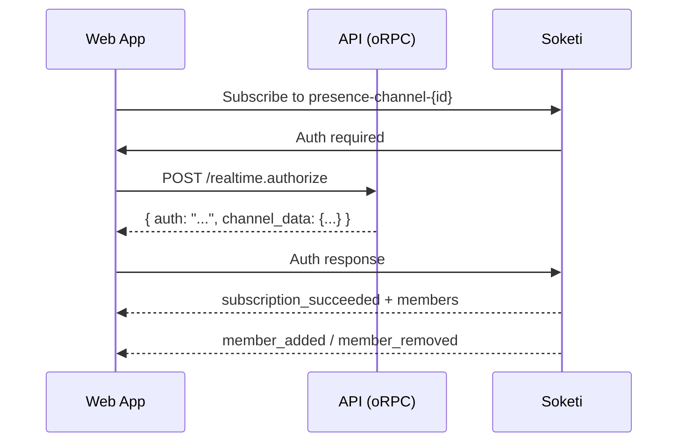
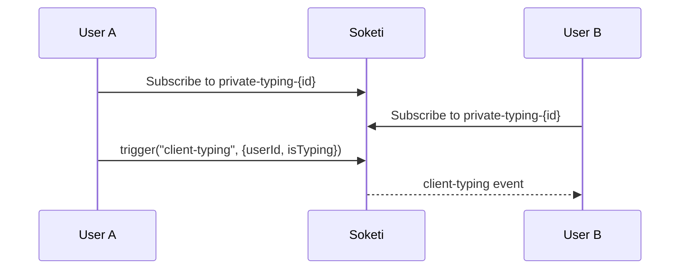

# Supabase → Soketi/Pusher Realtime Migration (work-holo)

## 1) Overview

This refactor removes the custom self-hosted WebSocket service and replaces realtime presence/typing with **Soketi** (open-source Pusher-compatible WebSocket server) using the **Pusher SDK**.

**Primary goals**
- Eliminate custom realtime server complexity
- Use battle-tested Pusher protocol for:
  - presence channels (who's online)
  - private channels (typing indicators)
  - client events (peer-to-peer messages)
- Leverage Soketi for self-hosted, Pusher-compatible infrastructure

**Repo layout (monorepo)**
- `packages/api/src/lib/pusher.ts` — Server-side Pusher client
- `packages/api/src/routers/realtime/` — Channel authorization endpoint
- `apps/web/src/lib/pusher.ts` — Web client Pusher wrapper
- `apps/web/src/hooks/communications/` — React hooks for presence/typing

---

## 2) Before vs After

### Before (Custom WebSocket Server)
- Custom Elysia WebSocket server in `apps/realtime/`
- Custom protocol with JWT grants
- Custom client library in `packages/realtime-client/`
- Required maintaining WebSocket reconnection, room management, presence tracking

### After (Soketi + Pusher SDK)
- Soketi runs as Docker container (Pusher-compatible)
- Standard Pusher SDK handles connections, reconnection, channels
- Server authorizes channels via `pusher.authorizeChannel()`
- No custom protocol or client library needed

---

## 3) Architecture

### 3.1 Soketi Server (Docker)

Soketi runs as a container in `docker-compose.yml`:

```yaml
soketi:
  image: quay.io/soketi/soketi:1.6-16-debian
  ports:
    - "6001:6001"
    - "9601:9601"
  environment:
    SOKETI_DEBUG: "1"
    SOKETI_DEFAULT_APP_ID: work-holo
    SOKETI_DEFAULT_APP_KEY: work-holo-key
    SOKETI_DEFAULT_APP_SECRET: work-holo-secret
    SOKETI_DEFAULT_APP_ENABLE_CLIENT_MESSAGES: "true"
```

### 3.2 Server (`packages/api`)

**Pusher client:** `packages/api/src/lib/pusher.ts`
- Initializes Pusher server SDK with Soketi connection details
- Used to authorize private/presence channels

**Authorization endpoint:** `packages/api/src/routers/realtime/index.ts`
- Validates user is authenticated
- Validates user has access to the channel
- Returns `pusher.authorizeChannel()` response

### 3.3 Web Client (`apps/web`)

**Pusher wrapper:** `apps/web/src/lib/pusher.ts`
- Singleton Pusher client with custom authorizer
- Authorizer calls API endpoint for channel auth

**Hooks:**
- `use-channel-presence.ts` — Presence channel subscription
- `use-typing-indicator.ts` — Private channel with client events

---

## 4) Channel Naming Convention

| Purpose | Channel Pattern | Type |
|---------|-----------------|------|
| Presence (who's online) | `presence-channel-{channelId}` | Presence |
| Typing indicators | `private-typing-{channelId}` | Private |

**Client events must be prefixed with `client-`** (e.g., `client-typing`)

---

## 5) Protocol & Message Flow

### 5.1 Presence Flow



### 5.2 Typing Flow



---

## 6) Configuration / Environment

### Required env vars

**Web app** (`apps/web/.env`)
```
VITE_PUSHER_KEY=work-holo-key
VITE_PUSHER_HOST=localhost
VITE_PUSHER_PORT=6001
```

**API server** (`apps/server/.env`)
```
PUSHER_APP_ID=work-holo
PUSHER_APP_KEY=work-holo-key
PUSHER_APP_SECRET=work-holo-secret
PUSHER_HOST=localhost
PUSHER_PORT=6001
```

---

## 7) Web App Integration

### 7.1 Presence hook

**File:** `apps/web/src/hooks/communications/use-channel-presence.ts`

```typescript
const channel = pusherClient.subscribe(`presence-channel-${channelId}`);

channel.bind("pusher:subscription_succeeded", (members) => {
  // Initial member list
});

channel.bind("pusher:member_added", (member) => {
  // User joined
});

channel.bind("pusher:member_removed", (member) => {
  // User left
});
```

### 7.2 Typing hook

**File:** `apps/web/src/hooks/communications/use-typing-indicator.ts`

```typescript
const channel = pusherClient.subscribe(`private-typing-${channelId}`);

// Listen for typing events
channel.bind("client-typing", ({ userId, isTyping }) => {
  // Update typing state
});

// Send typing event
channel.trigger("client-typing", { userId, isTyping: true });
```

---

## 8) Removed Packages

The following were removed in this migration:

- `apps/realtime/` — Custom Elysia WebSocket server
- `packages/realtime-client/` — Custom WebSocket client
- `packages/realtime-shared/` — Shared protocol types
- `packages/realtime-api/` — Server-side utilities
- `packages/env/src/realtime.ts` — Realtime env schema

---

## 9) How to Run Locally

1. Start Docker services:
   ```bash
   docker-compose up -d
   ```

2. Ensure env vars are set (see section 6)

3. Run dev:
   ```bash
   bun run dev
   ```

---

## 10) Verification Checklist

### Basic
- [ ] Pusher client connects to Soketi
- [ ] Presence channel subscription succeeds
- [ ] Members list populated on subscription
- [ ] member_added/member_removed events fire

### Typing
- [ ] Private channel subscription succeeds
- [ ] client-typing events sent and received
- [ ] Typing indicator shows/hides correctly

### Reconnection
- [ ] Stop Soketi, restart it
- [ ] Client reconnects automatically
- [ ] Channels resubscribed after reconnect

---

## 11) Production Considerations

### Soketi Deployment
- Use managed Pusher service OR self-host Soketi
- Configure horizontal scaling with Redis adapter
- Set proper app credentials (not defaults)

### Security
- Use TLS (wss://) in production
- Rotate app secrets periodically
- Validate channel access in authorization endpoint

---

## 12) Migration from Previous Custom System

If migrating from the previous custom realtime system:

1. Remove old packages (already done)
2. Update env vars (REALTIME_* → PUSHER_*)
3. Update hooks to use Pusher SDK patterns
4. Test presence and typing functionality
