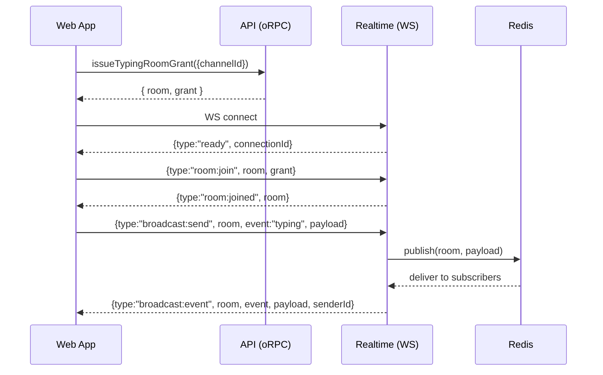

# Supabase → Self‑Hosted Realtime Migration (work-holo)

## 1) Overview
This refactor removes the remaining Supabase Realtime footprint and replaces realtime presence/typing with a **self-hosted WebSocket service** backed by **Redis Pub/Sub** and **JWT-based room grants**.

**Primary goals**
- Eliminate Supabase Realtime dependencies and config.
- Provide a stable realtime protocol for:
  - room join/leave
  - broadcast (typing)
  - presence tracking/sync
- Make reconnection *reliable* by automatically:
  - reconnecting
  - rejoining rooms
  - re-tracking presence
  - refreshing **expired room grants** and retrying the join silently

**Repo layout (monorepo)**
- `apps/realtime/` — Elysia (Bun) WebSocket server
- `packages/realtime-client/` — Web client library
- `packages/realtime-shared/` — Shared protocol (Zod + TS types)
- `packages/realtime-api/` — Server-side utilities (grant verifier, registry, presence, redis adapter)
- `packages/api/` — oRPC endpoints that issue grants
- `apps/web/` — React hooks that use realtime client

---

## 2) Before vs After

### Before (Supabase Realtime)
- Client joined supabase channels via `supabase.channel(...)` (presence/broadcast)
- Required Supabase env vars, package deps, and supabase CLI artifacts

### After (Self-hosted)
- Client connects to `VITE_REALTIME_URL` WebSocket endpoint and joins rooms via protocol messages.
- Authorization is via **short-lived JWT grants** issued by the API.
- Server is stateless for membership checks at join time (validate JWT + room match).

---

## 3) Architecture

### 3.1 Server (`apps/realtime`)
**Key file:** `apps/realtime/src/websocket.ts`

Responsibilities
- Accept WebSocket connections at `/ws`.
- Emit `ready` with `connectionId`.
- Handle `room:join`, `room:leave`, `broadcast:send`, `presence:track`, `presence:untrack`, `ping`.
- Verify join grants (`GrantVerifier`) and enforce room membership.
- Use Redis Pub/Sub to broadcast messages across nodes.
- Use `PresenceTracker` to read/write presence state in Redis.

Internal collaborators
- `ConnectionRegistry` — tracks connections and room membership
- `GrantVerifier` — validates JWT grant signature + room binding
- `RedisAdapter` — publish/subscribe wrapper
- `PresenceTracker` — presence state storage + retrieval

### 3.2 Client (`packages/realtime-client`)
**Key files**
- `packages/realtime-client/src/client.ts` — message multiplexer + room management
- `packages/realtime-client/src/room.ts` — per-room join/broadcast/presence + grant refresh
- `packages/realtime-client/src/websocket.ts` — reconnect/transport wrapper

Responsibilities
- Maintain a WebSocket connection.
- Manage multiple `Room` instances keyed by room name.
- On reconnect, automatically rejoin existing rooms.
- Restore presence tracking after room rejoin.

### 3.3 Shared protocol (`packages/realtime-shared`)
**Key file:** `packages/realtime-shared/src/protocol.ts`

- Zod schemas define a discriminated union `ClientMessage` and `ServerMessage`.
- Errors are structured as:
  - `{ type: "error", code: string, message: string, details?: Record<string, unknown> }`

---

## 4) Protocol & Message Flow

### 4.1 Typical join + broadcast

### 4.2 Presence flow
- Client joins a presence room
- Client sends `presence:track` with `{ state: { user_id: ... } }`
- Server:
  - stores state
  - notifies others (`presence:join`)
  - returns `presence:sync` to sender

---

## 5) Grant Model (JWT room grants)

### 5.1 Issuance (API)
**Key file:** `packages/api/src/routers/realtime/index.ts`

- Endpoints issue short-lived JWT grants.
- Example use cases:
  - presence room grant (caps: `presence`)
  - typing room grant (caps: `broadcast`)
- Shared signing secret: `REALTIME_GRANT_SECRET`

### 5.2 Verification (Realtime server)
**Key file:** `apps/realtime/src/websocket.ts`

- `handleRoomJoin()` verifies:
  - JWT is valid
  - JWT is bound to the requested room
- On verification failure, server emits an error.

---

## 6) Reconnect Restoration & Grant Refresh

### 6.1 Reconnect restoration (rooms)
**Key file:** `packages/realtime-client/src/client.ts`

- When server sends `ready` (including after reconnect), client:
  - stores new `connectionId`
  - calls `room.rejoin()` for all known rooms

### 6.2 Presence restoration
**Key file:** `packages/realtime-client/src/room.ts`

- `Room.trackPresence(state)` persists the last tracked state in memory.
- After receiving `room:joined`, the room automatically re-sends `presence:track` with the saved state.

### 6.3 Grant expiration + silent refresh
Grants expire (~5 min). If the tab reconnects later, `room:join` can fail.

Implemented behavior (silent, single retry):
1. Server sends `error` with `code: "INVALID_GRANT"` and `details.room` (see below).
2. Client routes the error to the matching `Room`.
3. Room calls `onRefreshGrant()` to fetch a new grant.
4. Room retries `room:join` once.
5. Only if refresh/retry is not possible does the global `onError` run.

**Server change (error context)**
- `apps/realtime/src/websocket.ts`
  - For join-related errors, includes:
    - `details: { room: message.room, action: "room:join" }`

**Client change (routing)**
- `packages/realtime-client/src/client.ts`
  - On `type: "error"`, checks `message.details?.room` and dispatches to that Room.

**Room change (refresh + retry guard)**
- `packages/realtime-client/src/room.ts`
  - Stores grant in a mutable field: `private grant: string`
  - Adds `hasRetriedJoinAfterRefresh` to avoid loops
  - `handleJoinError(code)` returns whether it handled the error

---

## 7) Web App Integration

### 7.1 Presence hook
**File:** `apps/web/src/hooks/communications/use-channel-presence.ts`

- Requests initial grant via:
  - `orpcClient.realtime.issuePresenceRoomGrant({ channelId })`
- Creates room with:
  - `onRefreshGrant: () => issuePresenceRoomGrant({ channelId }).grant`
- Sequence:
  - connect → waitForReady → join → waitForJoin → trackPresence

### 7.2 Typing hook
**File:** `apps/web/src/hooks/communications/use-typing-indicator.ts`

- Requests initial grant via:
  - `orpcClient.realtime.issueTypingRoomGrant({ channelId })`
- Creates room with:
  - `onRefreshGrant: () => issueTypingRoomGrant({ channelId }).grant`
- Broadcast typing via `room.broadcast("typing", payload)`.

---

## 8) Supabase Cleanup (what was removed)

### 8.1 Web app
- `apps/web/package.json`
  - removed dependency: `@supabase/supabase-js`
- `apps/web/vite.config.ts`
  - removed manual chunk entry for supabase
- `apps/web/.env.example`
  - removed Supabase env placeholders (e.g. `VITE_SUPABASE_URL`, `VITE_SUPABASE_PUBLISHABLE_KEY`)
- `apps/web/src/lib/supabase/index.ts`
  - removed legacy supabase wrapper

### 8.2 Database package
- `packages/db/package.json`
  - removed `supabase` CLI dev dependency
- `packages/db/supabase/`
  - removed Supabase CLI config directory
- `packages/db/src/lib/supabase/types.ts`
  - removed Supabase-generated DB types

### 8.3 Server app
- `apps/server/package.json`
  - removed `"trustedDependencies": ["supabase"]`
- `apps/server/.env.example`
  - removed Supabase env placeholders

---

## 9) Configuration / Environment

### Required env vars
- **Realtime server** (`apps/realtime/.env`)
  - `REALTIME_GRANT_SECRET` — JWT verification secret
  - `REDIS_URL` — Redis connection
- **API server** (`apps/server/.env`)
  - `REALTIME_GRANT_SECRET` — JWT signing secret (must match realtime)
- **Web app** (`apps/web/.env`)
  - `VITE_REALTIME_URL` — WebSocket URL, e.g. `ws://localhost:3002/ws`

---

## 10) How to Run Locally
1. Start Redis.
2. Provide matching `REALTIME_GRANT_SECRET` in both API + realtime.
3. Run dev:
   - `bun run dev`

---

## 11) Verification Checklist

### Basic
- [ ] WebSocket connects and receives `{type:"ready"}`.
- [ ] Room join succeeds and `room:joined` is received.
- [ ] Typing broadcast is received by other peers in room.
- [ ] Presence sync/join/leave flows work.

### Reconnect
- [ ] Stop realtime server, restart it.
- [ ] Client reconnects.
- [ ] Client automatically rejoins rooms.
- [ ] Presence is automatically re-tracked after rejoin.

### Grant expiry recovery
- [ ] Wait past grant TTL (or simulate).
- [ ] Trigger reconnect.
- [ ] Initial `room:join` fails with `INVALID_GRANT`.
- [ ] Client refreshes grant via `onRefreshGrant` and rejoins silently.

---

## 12) Known Notes
- Repo-wide `bun run check-types` currently reports unrelated existing TS issues in `apps/web`. The migration-specific files compile as part of the change, but the overall typecheck isn’t clean due to pre-existing errors.

---

## 13) Future Improvements (optional)
- Add `details.room` to more server errors (`NOT_IN_ROOM`, `LEAVE_FAILED`) for consistency.
- Add explicit error codes for expired vs invalid grants if the verifier distinguishes them.
- Add tests for reconnect + grant refresh flows.
